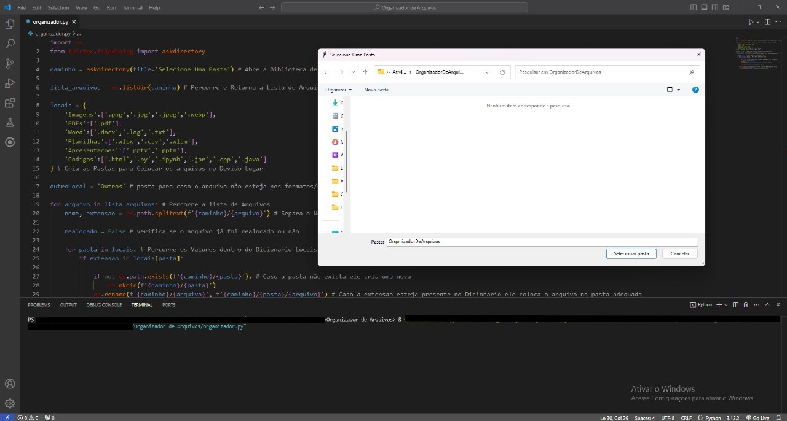
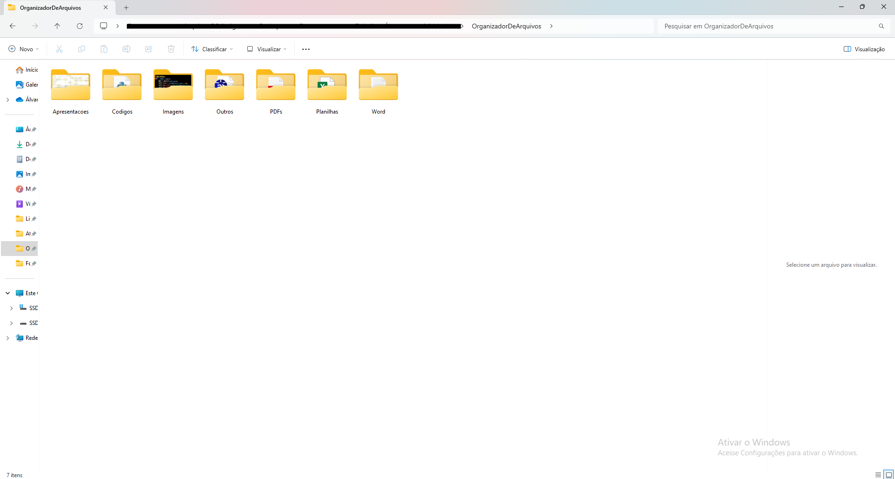

# Organizador de Arquivos por Extensão

Este script em Python organiza arquivos de uma pasta selecionada pelo usuário em subpastas baseadas nas extensões dos arquivos. Ele utiliza o módulo `os` para manipulação de arquivos e diretórios e o `tkinter` para permitir a seleção da pasta.

## 💻 Funcionalidades

- Cria pastas específicas para diferentes tipos de arquivos, como imagens, planilhas, PDFs, etc.
- Move os arquivos para suas respectivas pastas com base na extensão
- Cria uma pasta chamada **"Outros"** para armazenar arquivos que possuem extensões não especificadas no dicionário de categorias

## 📋 Pré-requisitos

- **Python 3.6 ou superior** instalado
- Bibliotecas padrão do Python:
  - `os`
  - `tkinter`
  - Use o comando `pip install os` e `pip install tkinter` no terminal

## 🛠️ Como usar

1. Clone ou baixe este repositório
2. Execute o script em um terminal ou IDE de sua escolha
   ```bash
   python organizador_arquivos.py
3. Uma janela aparecerá pedindo para você selecionar a pasta que deseja organizar

   
   
5. O script criará subpastas e moverá os arquivos automaticamente

   

## 🗂️ Estrutura das Pastas Criadas
As pastas são criadas com base no dicionário **`locais`**:

```
locais = {
    'Imagens': ['.png', '.jpg', '.jpeg', '.webp'],
    'Planilhas': ['.xlsx', '.csv', '.xlsm'],
    'PDFs': ['.pdf'],
    'Word': ['.docx', '.log', '.txt'],
    'Apresentacoes': ['.pptx', '.pptm'],
    'Codigos': ['.html', '.py', '.ipynb', '.jar', '.cpp', '.java']
}
```
# Exemplo:
- Arquivos .png e .jpg serão movidos para a pasta Imagens
- Arquivos .docx e .txt serão movidos para a pasta Word
- Arquivos com extensões desconhecidas serão movidos para a pasta Outros

# ✏️ Personalização
- Para adicionar ou remover categorias de arquivos, edite o dicionário locais dentro do código:
```
locais = {
    'NovaCategoria': ['.novaextensao']
}
```
# ⚠️ Observação
- Certifique-se de ter permissões para manipular arquivos e criar pastas no diretório selecionado
- Use com cuidado, após o código ser executado as subpastas serão criadas e os arquivos organizados
- Não tem como desfazer a organização de pastas. Não tem `Ctrl + Z`.
